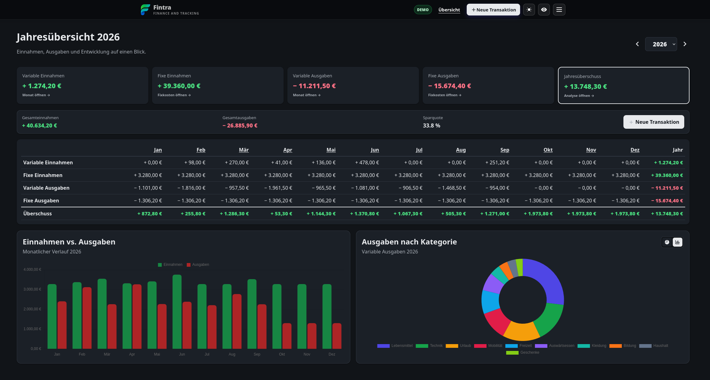
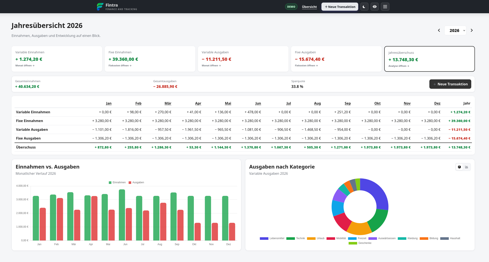

# Fintra

<p align="center">
  
</p>

<p align="center"><strong>Finance and Tracking</strong></p>

**A lightweight, self-hosted finance tracker.**

Fintra is a self-hosted web application for managing personal finances.  
It provides yearly and monthly overviews, recurring income and expenses, budgets,
financial analysis and visualizations while keeping your financial data on your own server.

> **Beta:** Fintra is currently under active development.  
> The current release is `9.6.0-beta.13`.


## Screenshots

### Dark Mode

<p align="center">
  
</p>

### Light Mode

<p align="center">
  
</p>

## Features

- 📅 Yearly and monthly financial overviews
- 💰 Income and expense tracking
- 🔁 Recurring income and expenses
- 🗂️ Custom categories
- 🎯 Monthly budgets
- 📊 Interactive charts and financial analysis
- 🔎 Algorithm & data structure demonstrations
- ✏️ Edit existing transactions
- 🌓 Light and dark mode
- 👁️ Privacy mode for hiding financial values
- 🔐 Local user account and password management
- 📱 Responsive interface
- 💾 SQLite database
- 📤 CSV export
- 🗄️ Database backup
- 🐳 Docker support
- 🖥️ TrueNAS SCALE support
- ❤️ Container healthcheck
- 🌐 No external frontend dependencies at runtime

## Privacy

Fintra is designed to be self-hosted.

Your financial data is stored in a local SQLite database and does not need to be
sent to an external cloud service.

The application also includes a **Privacy Mode** which can blur financial values
when sharing your screen or using Fintra around other people.

## Quick Start with Docker

Create a directory for persistent Fintra data:

```bash
mkdir -p ./data
```

Then run:

```bash
docker run -d \
  --name fintra \
  -p 8080:8080 \
  -v ./data:/app/data \
  --restart unless-stopped \
  ghcr.io/ninetofivedev/fintra:latest
```

Open:

```text
http://localhost:8080
```

On the first start, Fintra will guide you through creating the administrator account.

## Docker Compose

```yaml
services:
  fintra:
    image: ghcr.io/ninetofivedev/fintra:latest
    pull_policy: always
    container_name: fintra

    ports:
      - "8080:8080"

    environment:
      FINTRA_HTTPS_ONLY: "0"

    volumes:
      - ./data:/app/data

    restart: unless-stopped
```

Start Fintra with:

```bash
docker compose up -d
```

## TrueNAS SCALE

Fintra can also be deployed as a Custom App on TrueNAS SCALE.

Example:

```yaml
services:
  fintra:
    image: ghcr.io/ninetofivedev/fintra:latest
    pull_policy: always
    container_name: fintra

    ports:
      - "9080:8080"

    environment:
      FINTRA_HTTPS_ONLY: "0"

    volumes:
      - /mnt/POOL/apps/fintra/data:/app/data

    restart: unless-stopped
```

Replace `/mnt/POOL/apps/fintra/data` with the dataset or directory you want to use
for persistent Fintra data.

A more detailed TrueNAS example is available in:

```text
deploy/README-TRUENAS.md
```

## Persistent Data

Fintra stores its persistent application data in:

```text
/app/data
```

This includes:

```text
haushaltsbuch.db
.session_secret
```

When using Docker, always mount `/app/data` to persistent storage.

**Do not store your real financial database inside the container image.**

This allows Fintra to be updated or recreated without losing your financial data.

## Updating

Fintra container images are published through the GitHub Container Registry.

When using:

```text
ghcr.io/ninetofivedev/fintra:latest
```

you can update to the latest release by pulling the new image and recreating the container.

With Docker Compose:

```bash
docker compose pull
docker compose up -d
```

It is strongly recommended to create a database backup before updating.

## Healthcheck

Fintra provides:

```text
GET /health
```

A healthy instance responds with:

```json
{
  "status": "ok",
  "version": "9.6.0-beta.13"
}
```

The Docker image includes a healthcheck using this endpoint.

## Security

Fintra includes several security measures:

- passwords are hashed using `scrypt`
- CSRF protection for state-changing forms
- persistent session secret
- local authentication
- no financial database included in the Docker image
- database and environment files excluded from Git
- optional secure session cookies when running behind HTTPS

When Fintra is served exclusively through HTTPS, set:

```text
FINTRA_HTTPS_ONLY=1
```

## Algorithms & Data Structures

Fintra also contains an analysis section demonstrating algorithms and data structures
using financial data.

Currently implemented examples include:

- Hash Map based transaction indexing
- linear search comparison
- Min-Heap based Top-K analysis
- Sliding Window analysis
- Interquartile Range (IQR) outlier detection
- synthetic performance benchmarks with up to 100,000 transactions

This part of the project is also intended to explore practical applications of
algorithms and data structures in financial software.

## Development

Clone the repository:

```bash
git clone https://github.com/ninetofivedev/fintra.git
cd fintra
```

Build and start:

```bash
docker compose up -d --build
```

Fintra will then be available at:

```text
http://localhost:8080
```

## Releases

Fintra currently uses semantic-style beta versions:

```text
9.6.0-beta.1
9.6.0-beta.2
9.6.0-beta.3
9.6.0-beta.4
9.6.0-beta.5
```

Release container images are published to:

```text
ghcr.io/ninetofivedev/fintra
```

## Project Status

Fintra is currently **beta software**.

The application is usable, but features, database structures and deployment
details may still change before the first stable release.

If you encounter a bug or have an idea for improvement, feel free to open an issue.

## License

Fintra is open-source software licensed under the MIT License.

See [LICENSE](LICENSE) for details.
